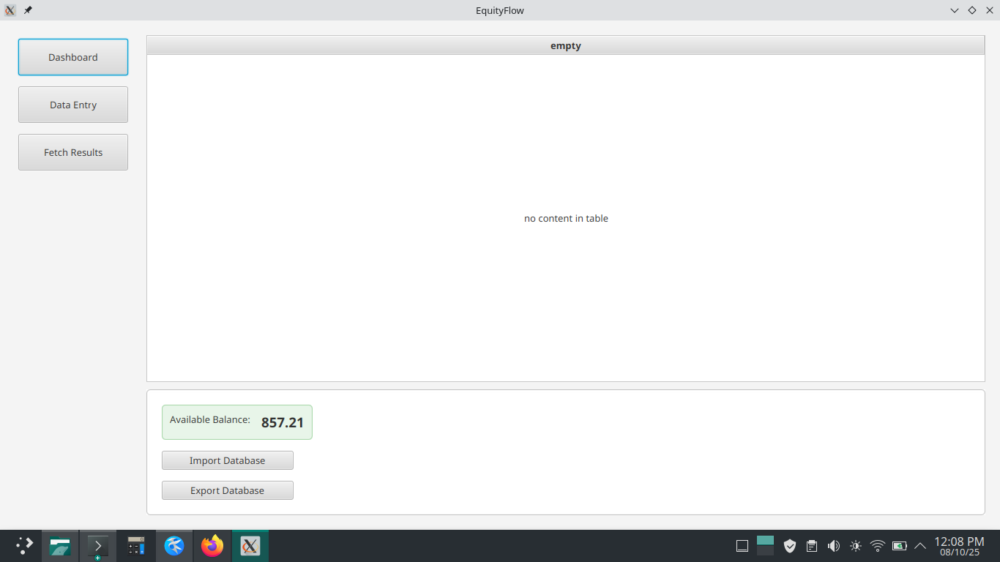

# EquityFlow: Personal Stock Portfolio Manager

EquityFlow is a desktop application built with JavaFX for personal stock portfolio management. It allows users to track their stock market transactions, monitor their portfolio's value, and analyze their investment performance.

## Features

- **Transaction Management:** Full CRUD (Create, Read, Update, Delete) operations for all your financial transactions (BUY, SELL, ADD FUNDS, CHARGES, etc.).
- **Portfolio Dashboard:** A clear and simple dashboard showing your total available cash balance.
- **Data Entry Form:** An intuitive form for inputting new transactions, which adapts based on the transaction type.
- **Reporting and Analysis:**
    - Generate detailed transaction histories for any specific stock.
    - View consolidated balances (total quantity and value) for a single stock or all stocks.
    - Generate statements for non-stock transactions (e.g., charges, funds added).
- **Data Portability:**
    - **Database Backup/Restore:** Export the entire database to a `.sql` file for backup and import it back when needed.
    - **CSV Import/Export:** Import transactions from a CSV file and export statements or balance summaries to CSV.

## Tech Stack

- **Core:** Java 11
- **UI:** JavaFX
- **Database:** MySQL
- **Build & Dependencies:** Apache Maven

## Screenshots

**Dashboard View:**



**Data Entry View:**


**Fetch Results View:**


## Setup and Installation

To get EquityFlow running on your local machine, follow these steps:

**1. Prerequisites:**

- Java JDK 11 or later.
- Apache Maven.
- MySQL Server.

**2. Database Setup:**

- Create a new database in your MySQL server. You can name it whatever you like (e.g., `equityflow_db`).
- Create a MySQL user with permissions to access this database.
- Run the `schema.sql` script in your new database to create the `demat_transactions` table. You can do this using a MySQL client or by running a command like:
  ```bash
  mysql -u your_username -p your_database_name < schema.sql
  ```

**3. Configure the Application:**

- In the root of the project, copy the `database.properties.template` file and rename it to `database.properties`.
- Open `database.properties` and update the `db.url`, `db.user`, and `db.password` fields with your database details.

  ```properties
  db.url=jdbc:mysql://localhost:3306/your_database_name
  db.user=your_username
  db.password=your_password
  ```

**4. Build and Run:**

- Open a terminal in the project's root directory.
- Build the project using Maven:

  ```bash
  mvn clean install
  ```

- Run the application:

  ```bash
  mvn javafx:run
  ```

## Usage

- Use the **Data Entry** tab to add, modify, or delete transactions.
- Use the **Dashboard** to see your available balance and to import/export the entire database.
- Use the **Fetch Results** tab to generate statements and view balances for specific stocks or transaction types.


